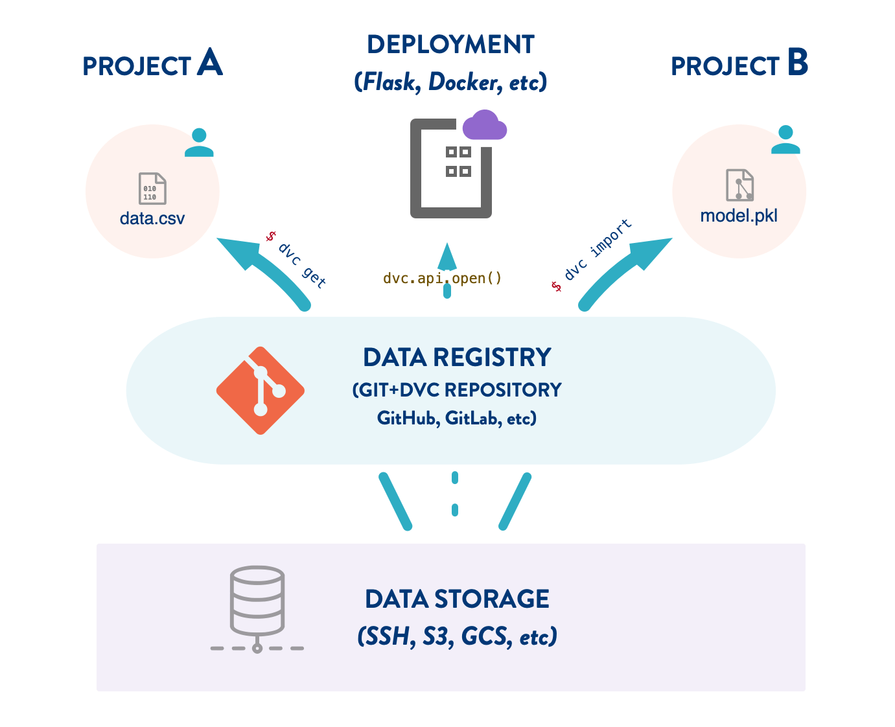

# Data versioning standard

Since an ML model is part code, part data, for an experiment to be reproducible one must keep track of not only the training code used but also the data the algorithm was trained on.

Unfortunately, widely used source-code version control systems such as `git` do not scale well for large datasets. Therefore, a special approach for data versioning is required.

This standard describes the architecture of a data registry based on `dvc` and shows how to:
* create a new data registry
* update a registry
* link an existing `git` repo to a data registry

## Data registry architecture

We will consider a multi-server case, assuming that several ML projects can use the same dataset. The registry structure is illustrated below and consists of 3 main parts:

* **Data storage** — a `dvc` storage, containing all the data of the registry. In our example, it will be hosted on a dedicated server, but it can also be deployed in a cloud (e.g. `S3`).
* **Data registry** — a `git` repository, containing a **Data storage** location along with special `.dvc` files for each dataset tracked. A single copy of this repository should be cloned on each server to be used as a dataset storage for each user project.
* **User projects**, that use data from the registry. They don't store the data itself but only a link to it in the **Data registry** on the same machine.



If each dataset is project-specific, then `git` repos for **Data registry** and **User project** can be merged into one. If, moreover, the development is carried out on a single server, a `dvc` cache created by default can be used as a **Data storage**.

## Creating a data registry

A data registry is created by invoking the `dvc init` command inside any `git` repo, but we recommend creating a separate repository with the following structure:

```bash
.
├── data       # Store your datasets here
│   ├── dataset_1
│   ├── dataset_2
│   └── ...
└── README.md  # Short description of datasets in data dir
```

The registry should be configured as follows:
```bash
dvc config cache.protected true
dvc config cache.type "symlink"
dvc remote add -d origin \
               ssh://<user>@<ip>/path/to/data/storage/
dvc remote modify origin ask_password true
```

Here we define an `ssh` remote by specifying a path to a currently empty dir on a dedicated server, but many other options exist (see `dvc` [docs](https://dvc.org/doc/command-reference/remote/add)).

The changes made must be committed and the resulting `git` repo should be cloned in the same location on each server, where data from the registry will be used.

## Updating the registry
The following steps should be taken in order to add a new dataset to the registry:
1. Branch out from current `master`
1. Copy the dataset to the `data` dir and start tracking it by both `git` and `dvc`:
    ```bash
    # should be executed from the registry root dir
    cp -r <new_data> ./data
    dvc add ./data/<new_data>
    git add ./data/<new_data>.dvc ./data/.gitignore
    git commit -m "<Short dataset description>"
    ```
1. Push changes to both `git` and `dvc` remotes:
    ```bash
    git push origin <my_branch>
    dvc push
    ```
1. Add a short dataset description to the `README.md`
1. Create a pull request

## Importing data to an ML project
In order to import data from a registry, `dvc` should be initialized in an ML project first:
```bash
# should be executed from the project root dir
dvc init
dvc cache dir /<path to a local data registry>/.dvc/cache
dvc config cache.protected true
dvc config cache.type "symlink"
```

After that, the data is imported as follows:
```bash
dvc import --rev <registry_branch> \
           https://github.com/<repo_path>.git \
           data/<my_data> ./data/
```
